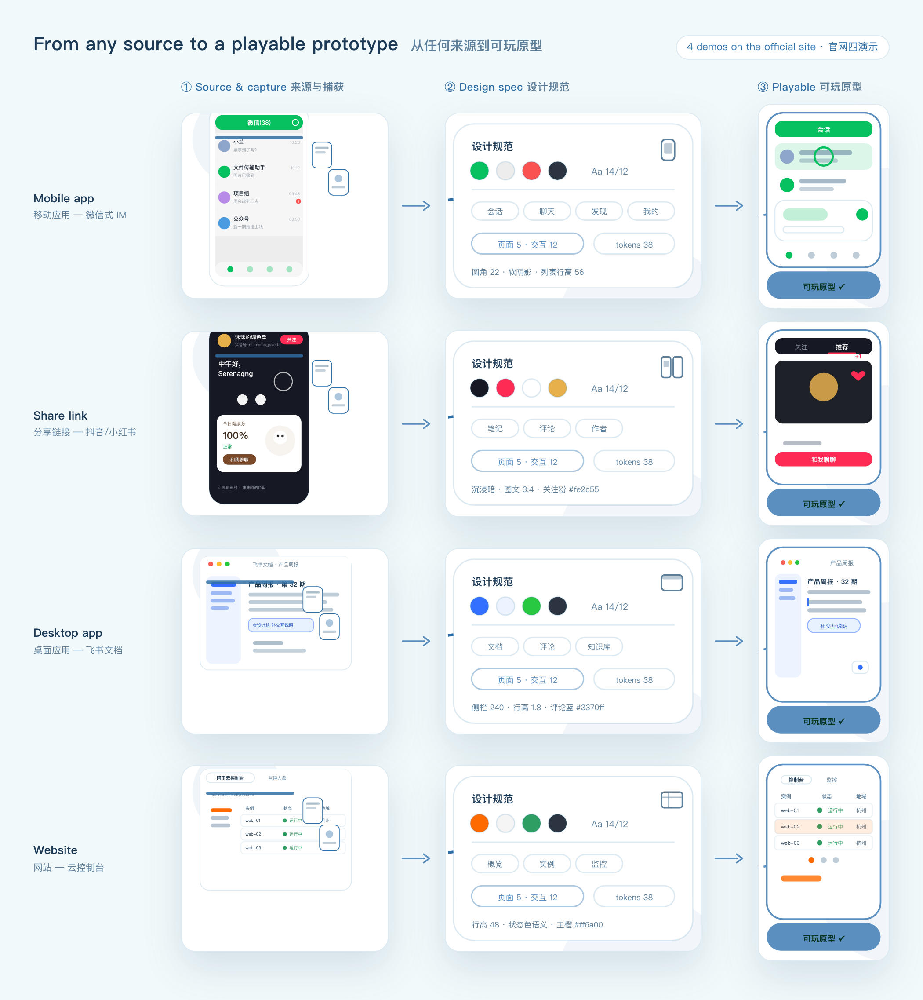

<div align="center">

<picture>
  <source media="(prefers-color-scheme: dark)" srcset="docs/img/logo-anim-dark.gif">
  
</picture>

# design-clone

**Clone any app into a playable prototype.** — 把任何应用克隆成可交互原型。

[](https://github.com/hello-cqq/design-clone/releases)
[](LICENSE)
[](https://github.com/hello-cqq/design-clone/actions)
[](https://github.com/hello-cqq/design-clone)

**[🌐 Official site & live gallery →](https://hello-cqq.github.io/design-clone/)** · [中文文档](README.zh.md) · [Gallery 画廊](https://hello-cqq.github.io/design-clone/gallery.html)


*↑ [AI Assistant](https://hello-cqq.github.io/design-clone/proto.html?app=ai-assistant): generated end-to-end by the skill — switch persona/voice, chat, call, play it live.*

</div>

---

## What it does

An [Agent Skill](https://agentskills.io) for opencode / Claude Code / Codex / Qoder / Qwen Code / Trae. Your agent captures a real app, website, desktop app, or a shared video/link — and rebuilds it as a **living PRD**: an offline interactive web prototype plus structured design assets (tokens, specs, paths, icons, covers). No paid API, no proprietary MCP; visual decisions use *your* agent's VLM.

- 📱 **Four sources** — app screens (adb/HID), websites (headless Chromium), video/image links (Douyin/Bilibili/XHS/YouTube…), or pure original design.
- 🎛 **Every control works** — hard-gated: `dead=0` clicks, live HTML views (never screenshot-as-view).
- 📐 **Design specs included** — per-page `spec.json` + Figma-importable source, tokens, annotations, interaction paths.
- 🖼 **Gallery-ready** — bilingual `meta.json` + icon + 3:2 cover auto-generated; one command publishes to the community gallery.

## Architecture

The skill runs entirely inside your agent — six local, offline stages from raw source to gated, playable output (deep dive: [`docs/ARCHITECTURE.md`](docs/ARCHITECTURE.md)):


## From any source to a playable prototype

<picture>
  <source media="(prefers-color-scheme: dark)" srcset="docs/img/feature-flow-dark.png">
  
</picture>

*The four [feature demos](https://hello-cqq.github.io/design-clone/) condensed: every source is captured, distilled into a design spec (palette · type · pages · tokens), and compiled into a prototype where every control works.*

## Install (one command)

```bash
curl -fsSL https://raw.githubusercontent.com/hello-cqq/design-clone/main/install.sh | bash
```

| Agent | Or pin it |
|---|---|
| opencode / claude / codex (auto-detected) | `--agent opencode` · `--ref v0.6.0` · `--channel snapshot` · `--skip-deps` |
| any Agent-Skills client | `npx skills add hello-cqq/design-clone -g -y --copy` |
| CLI-less platforms | download `design-clone.zip` from [Releases](https://github.com/hello-cqq/design-clone/releases) |

Then paste into your agent:

> **用 design-clone 克隆 <某个 app 或网址> 的设计原型** · *Clone <an app or URL> into a design prototype with design-clone.*

## Quick start

```bash
node <skill>/scripts/clone.mjs --target hn --platform web --url https://news.ycombinator.com --serve
# → capture → views → gates → http://localhost:4200/prototype/
```

## See it live

| | |
|---|---|
| [Gallery](https://hello-cqq.github.io/design-clone/gallery.html) | community prototypes, playable in-browser |
| [Guide](https://hello-cqq.github.io/design-clone/guide.html) | install → clone → publish in three moves |
| [Releases](https://github.com/hello-cqq/design-clone/releases) | semver trains + snapshot channels, zip assets |

## Docs & boundaries

- Skill manual: [`skills/design-clone/SKILL.md`](skills/design-clone/SKILL.md) · gates matrix: [`docs/GATES.md`](docs/GATES.md) · decisions/vision/lessons: [`docs/`](docs)
- **Privacy & IP**: real names/faces/PII are anonymized or regenerated; brand assets need consent; every run carries `PROVENANCE`. Clones are study baselines, not replacements for original design.
- **License**: MIT (code). Captured material remains property of its owners.

<div align="center"><sub>made with 🐾 by clones, for clones</sub></div>
